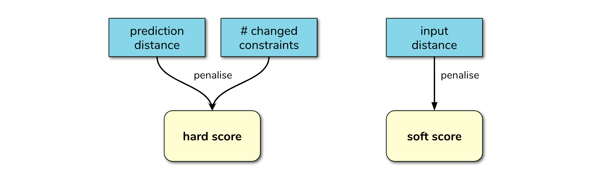

# Counterfactuals

## Using OptaPlanner

### Input features

### Using a `HardSoftScore`

With the `HardSoftScore` version, the solution is calculated by penalising the *hard score* when an input constraint is not met and by penalising the *soft score* as function of the Manhattan distance between the input and original features, and the distance between the prediction and desired outcome. 

### Using a `BendableScore`

With the `BendableScore` version, the solution is calculated by:

- penalising the *hard score* according to
    - the number of changed constrained parameters
    - the prediction is different from the goal
- penalising the *soft score* according the distance between the original and current input features

